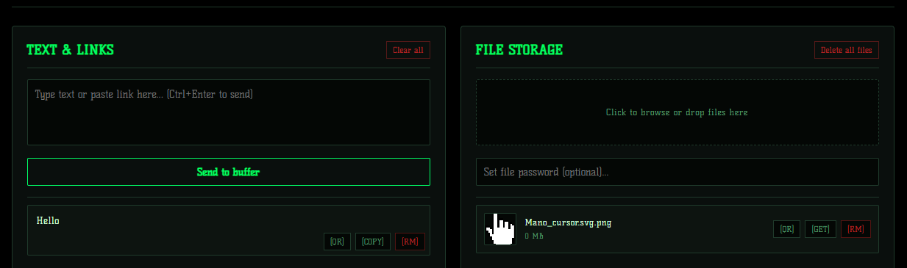

# FlashStash 🚀
A local micro-service for instant file and text exchange within a single Wi-Fi / LAN network.

## 📦 How to download and launch the portable version:
1. Download the latest release archive.
2. Unzip the archive into any convenient folder.
3. Run **run.bat**.
4. The script will automatically verify dependencies, start the server, and open the app in your browser.
5. To connect a smartphone or another PC, simply enter the IP address shown in the console (or scan the QR code directly from the UI).

## 🛠 Key Features:
* **Smart Access:** Automatically opens the app in your browser on startup, avoiding duplicate tabs.
* **Text & Links:** Share notes, snippets, and URLs instantly across devices.
* **File Transfer:** Drag-and-drop file sharing with built-in media previewers (images, video, audio).
* **Archive Support:** View the structure and contents of `.zip` and `.rar` files directly in the browser.
* **Password Protection:** Optional per-file encryption to keep your data secure from unauthorized users on the network.
* **Persistence:** Text history is automatically saved to disk and survives server restarts.
